# UTS Pengembangan Aplikasi Mobile

NIM:   1237050124  
Nama:  Madda Athia Rahman  
Kelas: B  

### Pengantar
Sebagaimana yang diminta, kami membuat suatu tampilan aplikasi mobile berbasis kotlin yang mengacu pada tampilan dan alur aplikasi yang sudah ditentukan pada eknows. Tujuannya adalah mengaplikasikan apa yang sudah kami pelajari selama setengah semester ini, mulai dari layout, activity, fragment, dsb. Jadi ada beberapa fungsi yang memang sengaja tidak dibuat karena batasan tadi, berikut merupakan hasil tampilan yang saya buat semirip mungkin dengan tampilan yang menjadi acuan kita.  

### Welcome Page

Pada halaman ini pengguna akan dihadapkan pada nama aplikasi dan tombol start untuk mengakses aplikasi.  
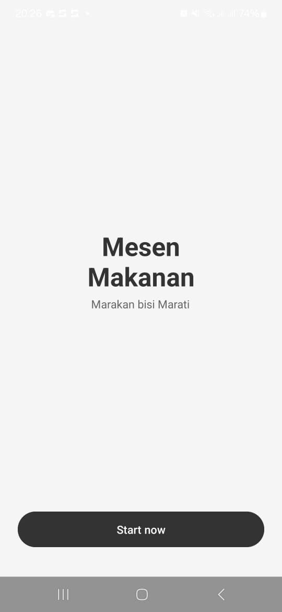

### Auth Page

Pada halaman ini pengguna diminta untuk melakukan verifikasi akun terlebih dahulu, jika belum terdaftar maka pengguna harus menekan tombol register, sedangkan apabila pengguna sudah terdaftar maka pengguna bisa langsung menekan tombol login. Namun, seperti hal yang sudah saya mention di awal, bahwa beberapa fungsi sengaja tidak dibuat, salah satunya ini dimana apapun yang ditulis pada form tidak akan disimpan, bahkan pengguna bisa saja menekan tombol login dan masuk aplikasi tanpa menuliskan apapun.  
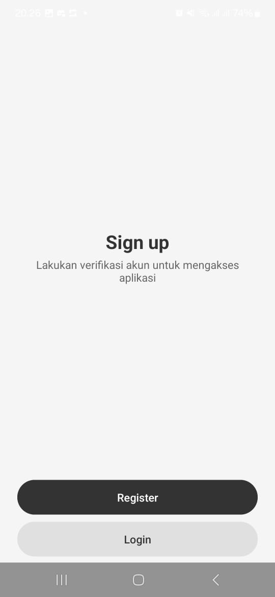

### Register Page

Pada halaman ini pengguna bisa mendaftarkan dirinya dengan menyertakan data diri juga menentukan password. Saat semua selesai dan tombol register ditekan, halaman akan dialihkan ke halaman login.  

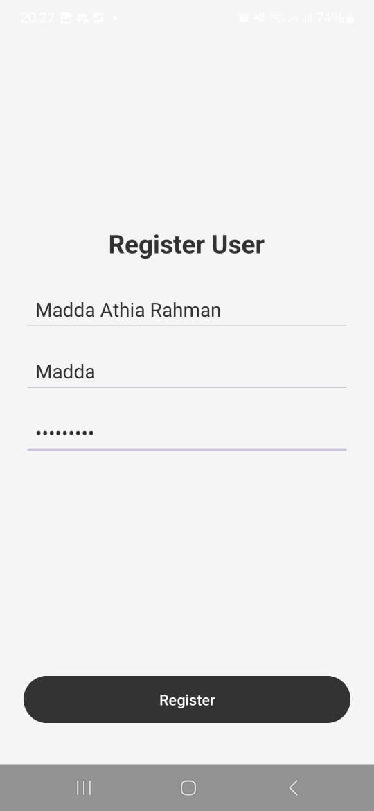

### Login Page

Pada halaman ini pengguna diminta mengisi form input username dan password, saat tombol login ditekan maka halaman akan berpindah ke halaman utama  
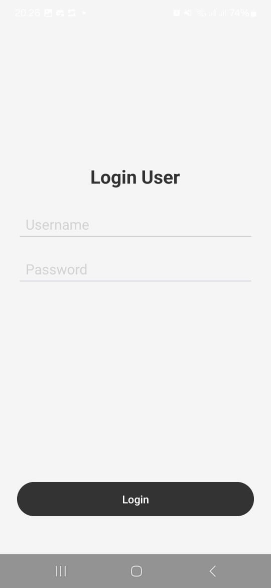
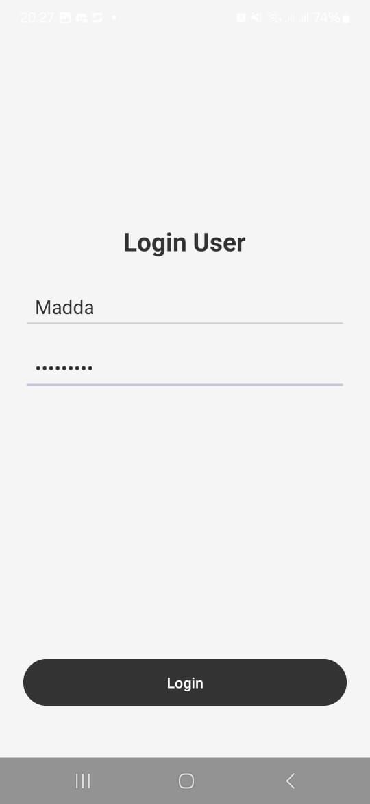

### Main Page

Halaman utama terdiri dari 3 halaman yang dibuat sebagai fragment, yaitu homepage, orderpage, dan profilepage. Saat tombol login ditekan, halaman pertama yang dilihat adalah homepage, lalu pengguna bisa beralih ke halaman lain dengan mengakses navigasi tab yang berada di bawah halaman. Untuk orderpage sendiri kita khususkan memiliki tampilan tidak seperti homepage dan profilepage yang sengaja dikosongkan karena tampilan yang diminta pun hanya orderpage. Pada orderpage kita bisa memilih makanan yang kita ingin pesan dengan menekan radio button yang ada, disini kita hanya bisa memilih satu karena memang tidak diminta untuk bisa multi order. Namun jika pengguna tidak memilih makanan maka akan muncul pesan bahwa pengguna harus memilih minimal dan maksimal 1 makanan. Saat proses dilanjutkan dengan menekan tombol lanjut, kita akan beralih ke orderdetailpage, dimana halaman ini juga merupakan fragment dan berfungsi untuk merekap ulang pesanan. Nama makanan yang ditampilkan pada orderdetailpage juga bersifat dinamis, akan menyesuaikan dengan makanan yang pengguna pilih. Lalu saat semuanya dirasa sudah selesai, pengguna bisa menekan tombol kirim dan akan dialihkan pada halaman pengisian form alamat.  
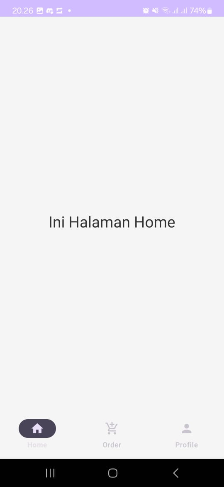
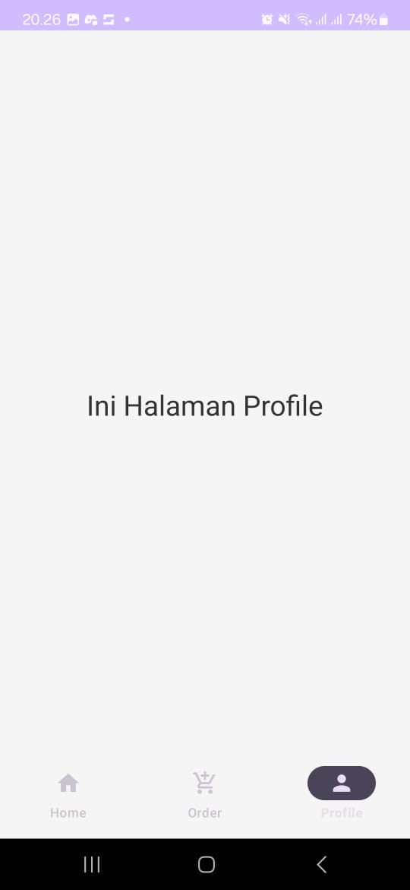
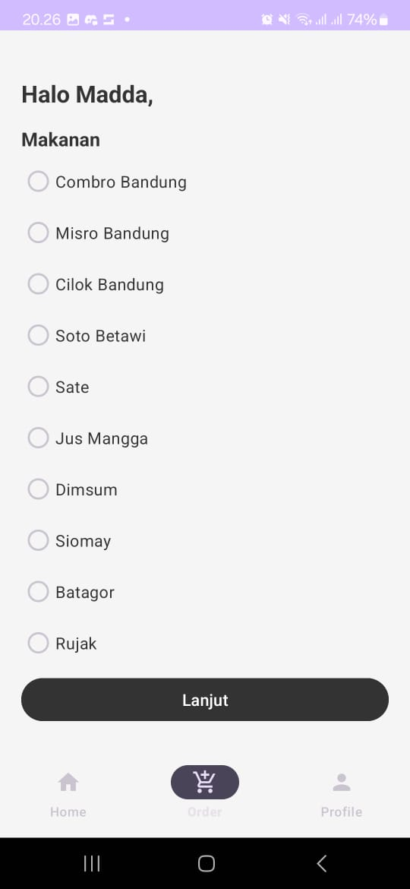
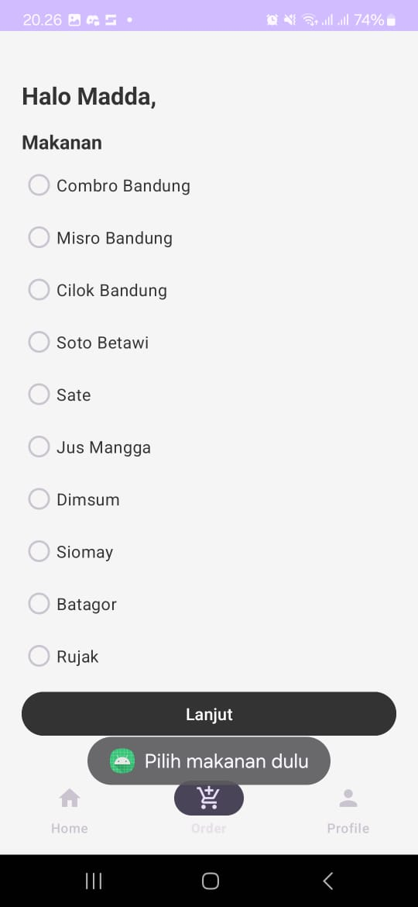
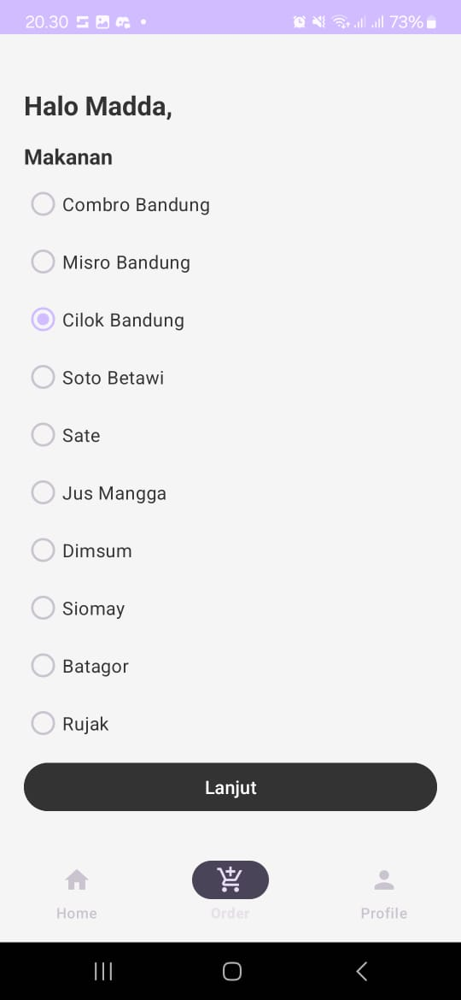
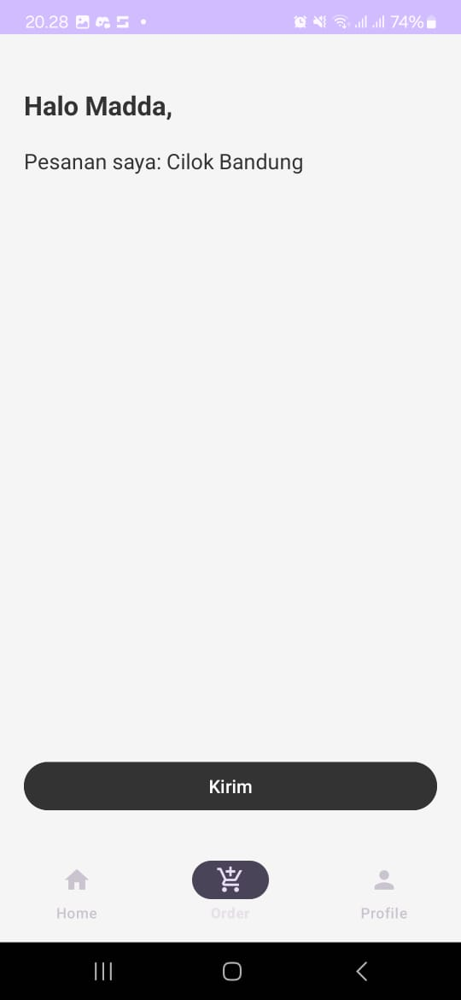

### Address Form Page

Pada halaman ini pengguna diminta untuk mengisi rincian nama, alamat juga catatan yang mungkin saja ingin diberikan pada penjual atau pun driver. Saat tombol pesan sekarang ditekan maka halaman akan berpindah ke halaman terakhir.  
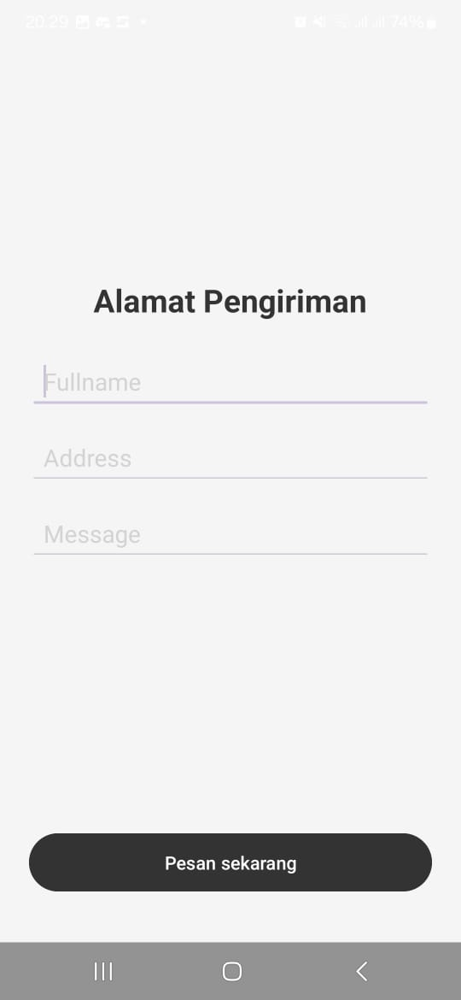

### Last Page

Pada halaman ini aplikasi memberikan pesan terimakasih pada pengguna, dan pengguna diberikan dua pilihan pada halaman ini, yaitu apakah pengguna ingin memesan lagi atau mengakhiri pemesanan dengan menekan tombol keluar, artinya aplikasi akan tertutup saat tombol itu ditekan.  
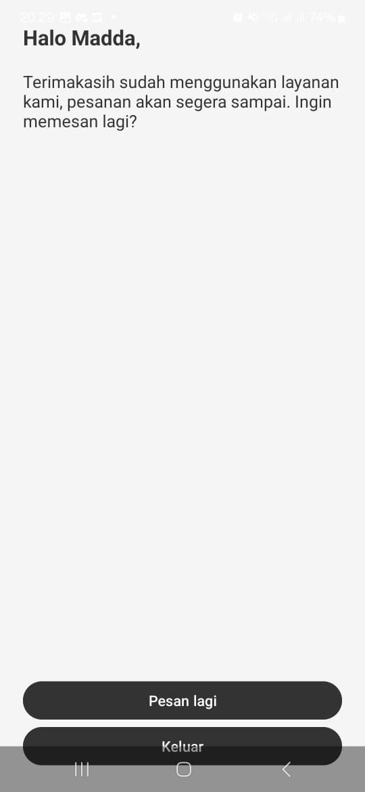

### Penutup

Begitulah tampilan yang saya buat, memang jauh dari kata sempurna, masih banyak kekurangan karena keterbatasan pengetahuan saya. Kedepan mungkin ini bisa jadi salah satu alasan kenapa saya jadi tertarik menekuni pengembagan aplikasi mobile, saat ini saya masi berfokus pada pengembangan web, namun tidak menutup kemungkinan kalau nanti saya akan mempelajari pengembangan mobile. Terimakasih semua.

